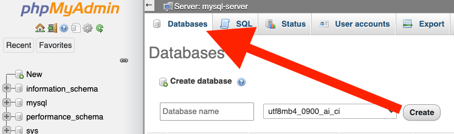

# Vending API

A simple REST service which will support a beverage vending machine that is tested via HTTP.

## Requirements

This is a LAMP installation. An Apache webserver that has PHP 7.1.32 and a MySQL 5.7.26 database is required. 

## Installation

1. Clone the repo.
2. From the command line, navigate to the repo you just cloned.
3. Run the following command to start the service.
``` docker compose up -d```
4. In your browser, navigate to http://localhost:5000/ to access phpMyAdmin
5. Create the database by clicking Databases.


## Usage

With your favorite API client the following HTTP requests can be made:

### Requests

#### Coin accepted:

```PUT http://localhost:8080```

Request Body:

```
{
“coin”: 1 
}
```

Response Code:

```204 OK```

Response Header:

```X-Coins: $[# of coins accepted]```

#### Coins returned:

```DELETE http://localhost:8080/```

Response Code:

```204 OK```

Response Header:

```X-Coins: $[# of coins to be returned]```

#### Get an array of integers of remaining item quantities:

```GET http://localhost:8080/inventory```

Response Code:

```200 OK```

Response Body:

```[#,#,#]```

#### Get remaining item quantity (an integer) where ```id=#``` is a zero-based indexed list of three options:

```GET http://localhost:8080/inventory/?id=#```

Response Code:

```200 OK```

Response Body:

```[#]```

#### Vend an item:

```PUT http://localhost:8080/inventory/?id=#```

Response Code:

```200 OK```

Response Headers:

```X-Coins: $[# of coins to be returned] X-Inventory-R emaining: $[item quantity]```

Response Body:

```
{
“quantity”: $[number of items vended]
}
```

#### Attempt to vend an item out of stock:

```PUT http://localhost:8080/inventory/?id=#```

Response Code:

```404 OK```

Response Headers:

```X-Coins: $[# of coins accepted]```

#### Attempt to vend with insufficient coins:

```PUT http://localhost:8080/inventory/?id=#```

Response Code:

```403 OK```

Response Headers:

```X-Coins: $[0|1]```